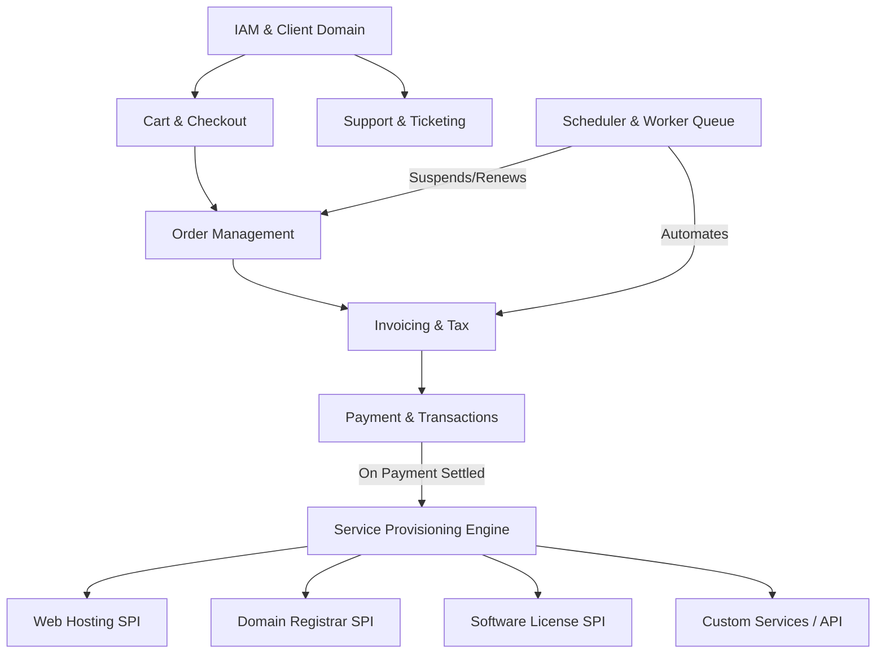

# Comprehensive Backend Architecture & System Specification
**Project:** Next-Gen Billing, Client Management & Service Provisioning Engine  
**Reference Architecture:** FOSSBilling Core Domain Modernization  
**Version:** 1.0.0 (Comprehensive Technical Design)

---

## 1. Executive Summary & System Objectives

The new backend is a high-performance, modular, and extensible billing, customer relationship management (CRM), and automated service provisioning system designed for hosting providers, digital service sellers, and SaaS platforms.

### 1.1 Key Objectives
1. **Financial Precision & Idempotency:** Zero-error invoice calculation, automated recurring billing, currency conversions, multi-tier taxation, and idempotent payment processing.
2. **Automated Service Lifecycle Management:** Abstracted Service Provisioning Interface (SPI) supporting Web Hosting, Domain Registrars, Software Licensing, and Custom APIs.
3. **Modular Monolith or Clean Microservices Architecture:** Domain-Driven Design (DDD) with clear boundaries, ready for horizontal scaling and event-driven extensions.
4. **Multi-Role Security & RBAC:** Strict separation of Public/Guest, Authenticated Client, and Staff/Admin capabilities with granular permission matrices and audit trails.

---

## 2. Core Domain Model & Subsystems



### 2.1 Identity & Access Management (IAM)
* **Clients (Customers):**
  * Account credentials, profile, billing address, custom attributes.
  * Account statuses: `ACTIVE`, `SUSPENDED`, `INACTIVE`, `EMAIL_VERIFICATION_PENDING`.
  * Client Credit/Balance ledger (allows pre-funding account).
  * Client Grouping & VIP pricing tiers.
* **Staff / Admin Users:**
  * Role-Based Access Control (RBAC) with fine-grained permissions per domain/module.
  * Staff action history & immutable audit log (`activity_admin_history`).
* **Authentication & Token System:**
  * JWT (Access Token + Refresh Token) or Secure Session Cookies.
  * Admin API Keys with scoped permissions (read/write/delete per module).
  * Rate-limiting & brute-force protection (IP lockout / CAPTCHA trigger).

---

### 2.2 Product Catalog & Dynamic Forms
* **Product Types:**
  * `HOSTING` (Server accounts, cPanel/Plesk plans).
  * `DOMAIN` (Registrations, transfers, renewals).
  * `LICENSE` (Software keys, node validation).
  * `DOWNLOADABLE` (Files, digital assets).
  * `CUSTOM` (Any recurring or one-off digital service).
* **Pricing & Billing Cycles:**
  * `FREE`
  * `ONETIME`
  * `RECURRING`: Weekly, Monthly, Quarterly, Semi-Annually, Annually, Biennially, Triennially.
  * Setup fees, trial periods, and currency-specific pricing matrices.
* **Dynamic Custom Forms (Form Builder):**
  * Configurable order fields per product (e.g., Domain input, OS template selection, Server location).
  * Field validation rules (regex, mandatory/optional, dropdowns, radio, checkboxes).

---

### 2.3 Order Management System (OMS)
* **Order Lifecycle State Machine:**
  * `PENDING_SETUP` $\rightarrow$ Invoice created, awaiting settlement.
  * `ACTIVE` $\rightarrow$ Service provisioned and active.
  * `SUSPENDED` $\rightarrow$ Overdue payment / TOS violation (service temporarily halted).
  * `CANCELED` $\rightarrow$ Canceled by user or admin.
  * `TERMINATED` $\rightarrow$ Account deleted from external server/provisioner.
* **Order Components:**
  * Link to Client, Product, and specific Service entity.
  * Price, Billing Cycle, Activation Date, Expires At, Next Due Date.
  * Addons & Configurable Options snapshots.

---

### 2.4 Invoicing, Taxation & Ledger
* **Invoice State Machine:**
  * `UNPAID` $\rightarrow$ `PAID` $\rightarrow$ `REFUNDED` $\rightarrow$ `CANCELED`.
* **Invoice Items:**
  * Line items with Title, Unit Price, Quantity, Taxable flag, Linked Order ID, Charge Period (`start_date` - `end_date`).
* **Tax Engine:**
  * Compound tax / Single tax rules based on Client Country/State.
  * EU VAT validation (VIES integration capability) and Reverse Charge support.
* **Credits & Balance:**
  * Invoices can be paid via Payment Gateways or deducted directly from `client_balance`.

---

### 2.5 Payment & Transaction Gateway Abstraction
* **Gateway Driver Interface:**
  * `getPaymentUrl(invoice)` $\rightarrow$ Redirect / Hosted payment page.
  * `processDirectPayment(payload)` $\rightarrow$ Credit Card / Direct API.
  * `handleWebhook(payload, headers)` $\rightarrow$ Idempotent IPN / Webhook processing.
  * `processRefund(transaction_id, amount)` $\rightarrow$ Partial or full refund.
* **Transaction Ledger:**
  * Records gateway type, transaction type (`PAYMENT`, `REFUND`, `CREDIT`), amount, currency, status, gateway reference ID, and raw payload history.

---

### 2.6 Service Provisioning Interface (SPI)

Every product type implements a standardized lifecycle interface:
```typescript
interface ServiceProvisioner {
  create(order: Order, config: ServiceConfig): Promise<ProvisionResult>;
  suspend(order: Order, reason: string): Promise<boolean>;
  unsuspend(order: Order): Promise<boolean>;
  renew(order: Order, period: BillingPeriod): Promise<boolean>;
  terminate(order: Order): Promise<boolean>;
  sync(order: Order): Promise<ServiceStatus>;
  changePackage(order: Order, newPackageId: string): Promise<boolean>;
  changePassword(order: Order, newPassword: string): Promise<boolean>;
}
```

* **Modules:**
  * `ServiceHosting`: Integrates with hosting control panels (cPanel/WHM, Plesk, DirectAdmin, Virtualmin, CyberPanel).
  * `ServiceDomain`: Integrates with Registrars (Namecheap, Openprovider, ResellerClub, Cloudflare Registrar). Handles WHOIS, EPP Auth Code, Nameserver management, DNS records.
  * `ServiceLicense`: Key generation algorithms, domain/IP lock binding, periodic pingback verification.
  * `ServiceDownloadable`: Secure expirable download tokens, download count limits.

---

### 2.7 Support & Ticket Desk
* **Helpdesk Categories & Departments:** Public vs Staff-only, priority levels (`LOW`, `MEDIUM`, `HIGH`, `URGENT`).
* **Ticket Threading:** Client messages, Staff replies, Private Internal Notes (Staff-only visibility).
* **Canned Responses & Knowledge Base (KB):** Multilingual KB categories and articles for self-service support.

---

### 2.8 Automation Engine & Background Jobs
* **Scheduler / Worker Tasks:**
  1. **Invoice Generator Job:** Runs daily. Finds active orders due in $N$ days (e.g., 14 days before due date) and issues renewal invoices.
  2. **Auto-Suspension Job:** Finds unpaid orders past grace period ($X$ days overdue) and invokes `ServiceProvisioner.suspend()`.
  3. **Auto-Termination Job:** Finds suspended orders overdue by $Y$ days and invokes `ServiceProvisioner.terminate()`.
  4. **Payment Reminder Notifications:** Sends email alerts at $T-7$, $T-3$, $T-0$, and overdue dates.
  5. **Exchange Rates Sync:** Fetches updated rates for configured currencies via open exchange APIs.
  6. **Email & Webhook Queue:** Asynchronous retrying email dispatcher.

---

## 3. Database Schema Blueprint (Key Entities)

```sql
-- 1. Identity & Clients
CREATE TABLE clients (
    id BIGINT PRIMARY KEY AUTO_INCREMENT,
    group_id BIGINT NULL,
    email VARCHAR(191) NOT NULL UNIQUE,
    password_hash VARCHAR(255) NOT NULL,
    first_name VARCHAR(100),
    last_name VARCHAR(100),
    company VARCHAR(150),
    address_1 VARCHAR(255),
    address_2 VARCHAR(255),
    city VARCHAR(100),
    state VARCHAR(100),
    postcode VARCHAR(20),
    country VARCHAR(2), -- ISO 3166-1 alpha-2
    phone_cc VARCHAR(10),
    phone VARCHAR(30),
    currency VARCHAR(3) DEFAULT 'USD',
    tax_exempt BOOLEAN DEFAULT FALSE,
    status ENUM('active', 'suspended', 'canceled') DEFAULT 'active',
    created_at TIMESTAMP DEFAULT CURRENT_TIMESTAMP,
    updated_at TIMESTAMP DEFAULT CURRENT_TIMESTAMP ON UPDATE CURRENT_TIMESTAMP
);

-- 2. Client Balance Ledger
CREATE TABLE client_balances (
    id BIGINT PRIMARY KEY AUTO_INCREMENT,
    client_id BIGINT NOT NULL,
    type ENUM('credit', 'debit') NOT NULL,
    amount DECIMAL(18, 4) NOT NULL,
    description TEXT,
    rel_id BIGINT NULL,
    created_at TIMESTAMP DEFAULT CURRENT_TIMESTAMP,
    FOREIGN KEY (client_id) REFERENCES clients(id) ON DELETE CASCADE
);

-- 3. Products
CREATE TABLE products (
    id BIGINT PRIMARY KEY AUTO_INCREMENT,
    category_id BIGINT NULL,
    type ENUM('hosting', 'domain', 'license', 'downloadable', 'custom') NOT NULL,
    name VARCHAR(255) NOT NULL,
    slug VARCHAR(255) NOT NULL UNIQUE,
    description TEXT,
    status ENUM('enabled', 'disabled', 'hidden') DEFAULT 'enabled',
    setup_type ENUM('free', 'onetime', 'recurring') DEFAULT 'recurring',
    config JSON NULL,
    created_at TIMESTAMP DEFAULT CURRENT_TIMESTAMP,
    updated_at TIMESTAMP DEFAULT CURRENT_TIMESTAMP ON UPDATE CURRENT_TIMESTAMP
);

-- 4. Invoices & Items
CREATE TABLE invoices (
    id BIGINT PRIMARY KEY AUTO_INCREMENT,
    serie VARCHAR(50) NOT NULL,
    nr VARCHAR(50) NOT NULL,
    client_id BIGINT NOT NULL,
    status ENUM('unpaid', 'paid', 'refunded', 'canceled') DEFAULT 'unpaid',
    currency VARCHAR(3) NOT NULL,
    currency_rate DECIMAL(18, 6) DEFAULT 1.000000,
    subtotal DECIMAL(18, 4) DEFAULT 0.0000,
    tax DECIMAL(18, 4) DEFAULT 0.0000,
    total DECIMAL(18, 4) DEFAULT 0.0000,
    tax_rate DECIMAL(6, 2) DEFAULT 0.00,
    due_at DATE NOT NULL,
    paid_at DATETIME NULL,
    created_at TIMESTAMP DEFAULT CURRENT_TIMESTAMP,
    updated_at TIMESTAMP DEFAULT CURRENT_TIMESTAMP ON UPDATE CURRENT_TIMESTAMP,
    FOREIGN KEY (client_id) REFERENCES clients(id) ON DELETE RESTRICT
);

CREATE TABLE invoice_items (
    id BIGINT PRIMARY KEY AUTO_INCREMENT,
    invoice_id BIGINT NOT NULL,
    order_id BIGINT NULL,
    title VARCHAR(255) NOT NULL,
    period VARCHAR(20) NULL,
    price DECIMAL(18, 4) NOT NULL,
    quantity INT DEFAULT 1,
    unit VARCHAR(50) DEFAULT 'unit',
    taxable BOOLEAN DEFAULT TRUE,
    created_at TIMESTAMP DEFAULT CURRENT_TIMESTAMP,
    FOREIGN KEY (invoice_id) REFERENCES invoices(id) ON DELETE CASCADE
);

-- 5. Orders & Subscriptions
CREATE TABLE client_orders (
    id BIGINT PRIMARY KEY AUTO_INCREMENT,
    client_id BIGINT NOT NULL,
    product_id BIGINT NOT NULL,
    invoice_id BIGINT NULL,
    status ENUM('pending_setup', 'active', 'suspended', 'canceled', 'terminated') DEFAULT 'pending_setup',
    title VARCHAR(255) NOT NULL,
    period VARCHAR(20) NOT NULL,
    price DECIMAL(18, 4) NOT NULL,
    currency VARCHAR(3) NOT NULL,
    config JSON NULL,
    activated_at DATETIME NULL,
    expires_at DATETIME NULL,
    next_due_date DATE NULL,
    suspended_at DATETIME NULL,
    suspension_reason TEXT NULL,
    created_at TIMESTAMP DEFAULT CURRENT_TIMESTAMP,
    updated_at TIMESTAMP DEFAULT CURRENT_TIMESTAMP ON UPDATE CURRENT_TIMESTAMP,
    FOREIGN KEY (client_id) REFERENCES clients(id) ON DELETE RESTRICT,
    FOREIGN KEY (product_id) REFERENCES products(id) ON DELETE RESTRICT
);

-- 6. Transactions
CREATE TABLE transactions (
    id BIGINT PRIMARY KEY AUTO_INCREMENT,
    invoice_id BIGINT NULL,
    gateway_id VARCHAR(50) NOT NULL,
    txn_id VARCHAR(191) NOT NULL,
    type ENUM('payment', 'refund') DEFAULT 'payment',
    amount DECIMAL(18, 4) NOT NULL,
    currency VARCHAR(3) NOT NULL,
    status ENUM('pending', 'complete', 'failed', 'refunded') DEFAULT 'pending',
    raw_payload JSON NULL,
    created_at TIMESTAMP DEFAULT CURRENT_TIMESTAMP,
    FOREIGN KEY (invoice_id) REFERENCES invoices(id) ON DELETE SET NULL
);
```

---

## 4. API Endpoints Specification

### 4.1 Global Conventions
* **Base URL:** `/api/v1`
* **Response Envelope:**
```json
{
  "success": true,
  "data": { ... },
  "error": null,
  "meta": {
    "page": 1,
    "limit": 20,
    "total_records": 120,
    "total_pages": 6
  }
}
```
* **Error Envelope:**
```json
{
  "success": false,
  "data": null,
  "error": {
    "code": "VALIDATION_FAILED",
    "message": "Invalid email address format.",
    "details": { "email": ["Must be a valid email address"] }
  }
}
```

---

## 5. Non-Functional Architecture & Security Requirements

### 5.1 Idempotency & Concurrency Controls
* **Payment Processing:** Every payment webhook and checkout transaction implements distributed locks keyed by `invoice_id` to prevent double-charging or duplicate provisioning triggers.
* **Idempotency Keys:** Support `Idempotency-Key` HTTP header for critical write operations.

### 5.2 Security Standards
* **Secrets Management:** Server passwords, API tokens, and private keys stored using authenticated encryption (AES-256-GCM).
* **Access Control:** Enforce Principle of Least Privilege for staff tokens.
* **Audit Trail:** Every state change appends an immutable entry to `audit_logs` including actor ID, actor type, IP address, and JSON diff.
