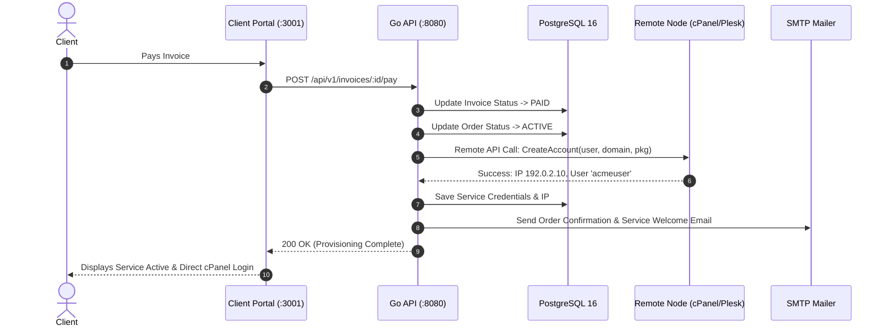

# Complete Step-by-Step Usage Guide

This comprehensive guide provides an end-to-end, step-by-step walkthrough of how to configure, operate, and use the **FOSSBilling Next-Gen Ecosystem** for both **Administrators** and **End Clients**.

---

## 🗺️ High-Level System Workflow

```mermaid
flowchart TD
    subgraph Admin Setup
        A[1. Admin Login & Company Info] --> B[2. Configure Currencies & Gateways]
        B --> C[3. Connect Server Nodes & Registrars]
        C --> D[4. Create Products & Custom Forms]
    end

    subgraph Client Experience
        E[5. Client Registers / Logs In] --> F[6. Browses Storefront & Domain Lookup]
        F --> G[7. Configures Order & Checks Out]
        G --> H[8. Pays Invoice via Gateway or Deposit]
    end

    subgraph Automated Fulfillment
        H --> I[9. Go Backend Triggers Provisioning]
        I --> J[10. Remote Server creates Account / Key generated]
        J --> K[11. Welcome Email & Credentials Sent]
    end

    subgraph Lifecycle & Support
        K --> L[12. Client Manages Services & Opens Support Tickets]
        L --> M[13. Worker issues Renewal Invoices 14 Days Prior]
        M --> N{Is Invoice Paid?}
        N -- Yes --> O[Service Renews Automatically]
        N -- No (7 days overdue) --> P[Automated Server Suspension]
    end

    Admin Setup --> Client Experience
```

---

## 🚀 Phase 1: Administrator Initial Configuration

Follow these steps when launching your FOSSBilling instance for the first time.

### Step 1.1: Log In to the Administrator Portal
1. Open your browser and navigate to the Administrator Portal:
   ```text
   http://localhost:3000  (or your custom admin domain, e.g., https://admin.yourhost.com)
   ```
2. Enter your administrator credentials:
   - **Email:** `admin@fossbilling.org` (or configured admin email)
   - **Password:** `admin123` (or configured admin password)
3. Click **Sign In** to access the Admin Dashboard.

### Step 1.2: Configure Company Branding & Contact Information
1. In the left sidebar, navigate to **Settings** ➔ **Company Information**.
2. Fill in the required fields:
   - **Company Name:** e.g., `Acme Cloud Hosting Ltd.`
   - **Company Email:** e.g., `support@acmecloud.com`
   - **Phone & Physical Address:** Displayed on official client invoices.
   - **Tax/VAT ID:** Your business registration or tax identification number.
   - **Company Logo URL:** SVG or PNG logo displayed in customer portal headers and PDF receipts.
3. Click **Save Company Profile**.

### Step 1.3: Set Default Currency & Exchange Rates
1. In the sidebar, navigate to **Settings** ➔ **Currencies**.
2. Set your **Primary Default Currency** (e.g., `USD - $` or `EUR - €` or `IDR - Rp`).
3. Add secondary currencies with their exchange conversion rates (e.g., `1 USD = 0.92 EUR` or `1 USD = 15,500 IDR`).
4. Click **Update Currency Rates**.

### Step 1.4: Configure Outgoing Email (SMTP)
1. Navigate to **Settings** ➔ **Email Settings**.
2. Choose **Transport Type**: `SMTP` (recommended) or `Sendmail`.
3. Provide your SMTP server details:
   - **SMTP Host:** e.g., `smtp.mailgun.org` or `smtp.sendgrid.net`
   - **SMTP Port:** `587` (TLS) or `465` (SSL)
   - **Username & Password:** Your SMTP credentials.
   - **From Name & Address:** e.g., `Acme Billing <billing@acmecloud.com>`
4. Click **Send Test Email** to verify delivery.

---

## 💳 Phase 2: Configuring Payment Gateways

FOSSBilling supports automated instant payment reconciliation across global and regional payment gateways.

### Step 2.1: Enable & Configure Stripe
1. In the Admin sidebar, navigate to **Settings** ➔ **Payment Gateways**.
2. Locate **Stripe** and click **Configure**:
   - **Enabled:** Toggle to `Active`.
   - **Publishable Key:** `pk_test_...` (or `pk_live_...`)
   - **Secret Key:** `sk_test_...` (or `sk_live_...`)
   - **Webhook Signing Secret:** `whsec_...`
3. In your Stripe Dashboard, set the Webhook endpoint to:
   ```text
   https://api.yourhost.com/api/v1/gateways/stripe/webhook
   ```
4. Click **Save Gateway**.

### Step 2.2: Enable PayPal Express / Checkout
1. Locate **PayPal** in the Payment Gateways list.
2. Enter your **Client ID**, **Secret**, and select **Sandbox** (for testing) or **Live**.
3. Enable instant IPN / Webhook callbacks to `/api/v1/gateways/paypal/webhook`.

### Step 2.3: Enable Regional Gateways (Midtrans QRIS / Virtual Accounts)
1. Locate **Midtrans** in the Payment Gateways list.
2. Enter your **Server Key** and **Client Key**.
3. Toggle payment channels: `QRIS`, `BCA Virtual Account`, `Mandiri VA`, `BNI VA`, `GoPay`, `ShopeePay`.
4. Click **Save Gateway**.

### Step 2.4: Enable Offline Bank Wire / Custom Transfer
1. Click **Bank Wire Transfer**.
2. Enter your bank details (Bank Name, Account Number, Account Holder, SWIFT/IBAN).
3. Set instructions for clients to upload transfer receipts or reply with proof of payment.

---

## 🖥️ Phase 3: Connecting Server Provisioners & Domain Registrars

### Step 3.1: Connect a Shared Hosting Server (cPanel / HestiaCP / Plesk / DirectAdmin)
1. In the sidebar, navigate to **Infrastructure** ➔ **Servers** (or `Servers & Nodes`).
2. Click **+ Add New Server**.
3. Enter server details:
   - **Server Name:** e.g., `US-East-cPanel-Node01`
   - **Hostname / IP:** `cpanel1.yourhost.com` (or `192.0.2.10`)
   - **Server Manager Driver:** Select `WHM / cPanel`, `HestiaCP`, `Plesk REST`, `DirectAdmin`, or `CWP`.
   - **API Port:** `2087` (WHM SSL), `8083` (Hestia), `8443` (Plesk), `2222` (DirectAdmin), or `2304` (CWP).
   - **Authentication:** Enter your API Token or Root/Admin Access Key.
   - **Primary Nameservers:** `ns1.yourhost.com`, `ns2.yourhost.com`
4. Click **Test Connection**:
   - The Go engine will perform an automated handshake with the remote API.
   - A green confirmation badge `Connection Successful (Latency: 42ms)` indicates the server is ready.
5. Click **Create Server**.

### Step 3.2: Connect a Domain Registrar
1. Navigate to **Infrastructure** ➔ **Domain Registrars**.
2. Click **Configure Registrar** on your provider (e.g., `Namecheap`, `ResellerClub`, or `Internet.bs`).
3. Enter your **API User**, **API Key**, and your server's whitelisted outgoing IP.
4. Click **Test Registrar API**.

---

## 📦 Phase 4: Setting Up Products & Services

FOSSBilling supports 4 primary product types: **Web Hosting**, **Domain Names**, **Downloadable Assets**, and **Software Licenses**.

### Step 4.1: Create a Shared Hosting Product
1. Navigate to **Products** ➔ **+ Add Product**.
2. **General Tab:**
   - **Product Name:** e.g., `Pro Cloud Hosting`
   - **Type:** Select `Hosting / Server`.
   - **Category:** `Web Hosting`
   - **Description:** Provide markdown feature list (e.g., Unlimited Bandwidth, 50 GB NVMe, Free SSL).
3. **Pricing Tab:**
   - Set billing cycle prices: Monthly (`$9.99`), Annual (`$99.00`), Triennial (`$249.00`).
   - Setup Fee (optional): `$0.00`.
4. **Provisioning Tab:**
   - **Assigned Server:** Select `US-East-cPanel-Node01`.
   - **Remote Package Name:** Exact package name defined in WHM/Hestia (e.g., `cpanel_50gb_plan`).
   - **Auto-Provisioning Trigger:** `Immediately upon invoice payment`.
5. Click **Create Product**.

### Step 4.2: Configure Domain TLD Pricing
1. Navigate to **Products** ➔ **Domain TLDs**.
2. Click **+ Add TLD**:
   - **TLD:** `.com`
   - **Registration Price:** `$12.99 / yr`
   - **Renewal Price:** `$14.99 / yr`
   - **Transfer Price:** `$11.99`
   - **Assigned Registrar:** `Namecheap API`
   - **Features:** Check `DNS Management`, `Email Forwarding`, `ID Protection`.
3. Repeat for `.net`, `.org`, `.id`, `.io`, etc.

### Step 4.3: Create a Software License Product
1. Click **+ Add Product** ➔ Select Type `License Key`.
2. Set product details: `Enterprise SaaS Addon License`.
3. Set **Key Format Mask**: `FOSS-XXXX-XXXX-XXXX`.
4. Set **Max Allowed Domain / IP Bindings**: e.g., `2`.
5. Set license duration: `Recurring Monthly ($29.00/mo)` or `One-time Lifetime ($199.00)`.

### Step 4.4: Create a Digital Download Product
1. Click **+ Add Product** ➔ Select Type `Downloadable Product`.
2. Enter product details: `WordPress E-Commerce Theme Pro`.
3. Upload the secure file or provide file path in storage.
4. Set **Download Link Expiration**: `24 hours` (dynamically HMAC-signed per customer session).

---

## 🛒 Phase 5: Client Ordering & Purchasing Journey

Here is the exact step-by-step path an end-customer follows when purchasing from your FOSSBilling portal.

### Step 5.1: Client Browsing & Account Registration
1. Customer visits the Client Portal at:
   ```text
   http://localhost:3001  (or https://client.yourhost.com)
   ```
2. Customer clicks **Storefront** or **Get Started**.
3. If new, the customer registers with Name, Email, Password, and Phone:
   - Security features like **Honeypot protection** and **Disposable email blocking** prevent spam bots automatically.

### Step 5.2: Selecting a Service & Domain Option
1. In the Storefront catalog, customer chooses **Pro Cloud Hosting** and clicks **Order Now**.
2. The domain step prompts the customer:
   - 🔘 **Register a new domain:** Customer types `myawesomebrand` + `.com`, system performs instant live WHOIS lookup.
   - 🔘 **Transfer existing domain:** Customer enters domain and EPP/Auth code.
   - 🔘 **Use own domain:** Customer enters existing domain and receives your nameservers (`ns1.yourhost.com`).
3. Customer selects their preferred billing cycle (e.g., `Annual - $99.00/yr (Save 17%)`).

### Step 5.3: Applying Promo Codes & Reviewing Cart
1. Customer is taken to `/cart`.
2. Customer can input a coupon code (e.g., `LAUNCH20` for 20% discount).
3. The cart recalculates itemized subtotal, taxes (if applicable), and final balance in real-time.
4. Customer clicks **Proceed to Checkout**.

### Step 5.4: Invoice Settlement
1. An official Pro-forma invoice is generated (e.g., `Invoice #INV-2026-0042`).
2. Customer selects payment method:
   - **Credit / Debit Card (Stripe):** Enters card details with 3D-Secure authentication.
   - **PayPal:** Redirects to PayPal modal and completes 1-click payment.
   - **Midtrans QRIS:** Scans QR code using any banking / e-wallet app (BCA, GoPay, OVO).
   - **Account Balance:** If the client deposited prepay funds earlier, payment settles instantly with zero clicks.
3. Once transaction succeeds, the invoice is marked `PAID` with a transaction reference number.

---

## ⚡ Phase 6: Automated Order Fulfillment & Provisioning

Once an invoice is settled, the Go Backend engine immediately executes the fulfillment pipeline:



1. **Remote Account Creation:** The driver connects to WHM/cPanel or HestiaCP and provisions the virtual host, disk quota, and email limits.
2. **License Key Generation:** For license products, a unique HMAC key is minted and registered in PostgreSQL.
3. **Digital Download Tokens:** For downloadable files, single-use signed URLs are generated.
4. **Automated Welcome Email:** Customer receives an email containing their server IP, temporary password, control panel URL, and nameserver instructions.

---

## 👥 Phase 7: Client Portal Self-Service Operations

Customers have complete autonomy over their active services without needing administrator intervention.

### Step 7.1: Managing Hosting Accounts & cPanel Single Sign-On (SSO)
1. Customer clicks **Services** in the client navbar.
2. Clicks on **Pro Cloud Hosting**:
   - Views Disk Usage, Bandwidth Usage, Primary IP, and Assigned Nameservers.
   - Clicks **Log in to Control Panel (SSO)**: Automatically redirects into cPanel/HestiaCP dashboard without re-typing passwords.
   - Clicks **Change Password** to update FTP/Control Panel passwords securely.

### Step 7.2: Managing Software Licenses
1. Customer navigates to **Services** ➔ **Licenses**.
2. Customer views active license keys (`FOSS-ABCD-1234-EFGH`).
3. To migrate software to a new server, customer clicks **Reset Domain/IP Binding**.
4. The client's application pings `/api/v1/license/verify` to validate license status in real time.

### Step 7.3: Accessing Digital Downloads
1. Customer navigates to **Downloads**.
2. Clicks **Download Latest Build (v2.4.0)**.
3. The server serves the file through an authenticated, rate-limited streaming handler.

### Step 7.4: Submitting Helpdesk Support Tickets
1. Customer navigates to **Support** ➔ **+ Open New Ticket**.
2. Selects **Department** (`Technical Support`, `Billing`, `Sales`).
3. Selects **Priority** (`Low`, `Medium`, `High`, `Urgent`).
4. Selects **Related Service** (e.g., `Pro Cloud Hosting - myawesomebrand.com`).
5. Types message and attaches error screenshots or logs (`.png`, `.jpg`, `.pdf`, `.txt`, `.log`).
6. Clicks **Submit Ticket**.
7. Real-time updates notify the customer when an administrator replies.

---

## 🔄 Phase 8: Subscription Billing, Dunning & Suspension Lifecycle

The FOSSBilling Background Worker (`cmd/worker`) automates recurring billing unattended:

```text
Day -14:  Worker generates Renewal Invoice #INV-1090.
          Client receives "Upcoming Renewal Invoice" email.
          If client has Account Credit Balance, invoice is AUTO-PAID immediately.

Day 0:    Invoice Due Date.
          Reminder email sent if unpaid.

Day +3:   First Overdue Reminder email sent.

Day +7:   Grace period expires!
          Worker automatically executes remote SuspendAccount() via cPanel/Hestia API.
          Client service state changes to SUSPENDED.
          Website displays suspension notice.

Anytime:  Client settles Invoice #INV-1090.
          Worker/Event instantly executes remote UnsuspendAccount().
          Service restored immediately without human delay.
```

---

## 🛠️ Phase 9: Administrator Daily Operations & Management

### Step 9.1: Managing Clients & Manual Account Credits
1. In Admin Portal, navigate to **Clients** ➔ **All Clients**.
2. Search by Name, Email, or Company.
3. Open a Client Profile:
   - **Edit Profile:** Update billing address or tax residency.
   - **Adjust Balance / Add Funds:** Credit customer account (e.g., `+$50.00` refund credit or promotional balance).
   - **View Invoices & Orders:** View all historical purchases and active service subscriptions.
   - **Staff Internal Notes:** Add notes visible only to administrators.

### Step 9.2: Manual Invoice Generation & Adjustments
1. Navigate to **Billing** ➔ **Invoices** ➔ **+ Create Invoice**.
2. Select the client.
3. Add custom line items (e.g., `Custom Server Migration Service - $75.00`).
4. Set tax status and due date.
5. Click **Issue Invoice**: Client is notified by email with a PDF attachment.

### Step 9.3: Handling Support Tickets
1. Navigate to **Support** ➔ **Tickets**.
2. Filter by status: `Open`, `Waiting Client Reply`, `Escalated`, `Closed`.
3. Click a ticket to view conversation thread:
   - Reply with **Canned Responses** for common questions.
   - Assign ticket to specific staff members.
   - Add **Internal Staff Notes** (highlighted in yellow, invisible to client).
   - Change ticket status to `Resolved` or `Closed`.

### Step 9.4: System Health & Audit Logging
1. Navigate to **System** ➔ **Activity Logs**.
2. Filter audit entries by staff member, IP address, or action type (e.g., `server.suspend`, `invoice.refund`, `gateway.update`).
3. Under **System** ➔ **Diagnostics**, inspect Go API response latency, Redis queue backlog, and database connection pool health.

---

## 💻 Phase 10: Terminal CLI Management (`fossbilling-cli`)

Administrators can also manage FOSSBilling directly from the server terminal:

```bash
# Display CLI help and available command groups
./backend-go/bin/cli --help

# Run database migrations
./backend-go/bin/cli db:migrate

# Seed database with sample testing data
./backend-go/bin/cli db:seed

# Create a new Administrator user
./backend-go/bin/cli admin:create --email="admin@yourhost.com" --password="StrongPassword123!"

# Manually trigger recurring billing cron cycle
./backend-go/bin/cli cron:run

# Clear Redis and application cache
./backend-go/bin/cli cache:clear
```

---

## 🎯 Summary Checklist for Go-Live

| Step | Action | Status |
| :--- | :--- | :---: |
| 1 | Configure Company Name, Logo, & Address | [ ] |
| 2 | Set Default Currency & Conversion Rates | [ ] |
| 3 | Configure SMTP Outgoing Email & Test Delivery | [ ] |
| 4 | Add at least one Payment Gateway (Stripe, PayPal, or Midtrans) | [ ] |
| 5 | Connect Hosting Server (cPanel/Hestia/Plesk) & Verify Handshake | [ ] |
| 6 | Create Hosting Packages & Domain TLD Pricing | [ ] |
| 7 | Perform End-to-End Test Purchase from Client Portal | [ ] |
| 8 | Verify Automated Provisioning & Welcome Email Receipt | [ ] |
| 9 | Confirm Background Worker Daemon (`cmd/worker`) is Running | [ ] |

With this workflow in place, your FOSSBilling platform is fully automated and ready for production operations!
